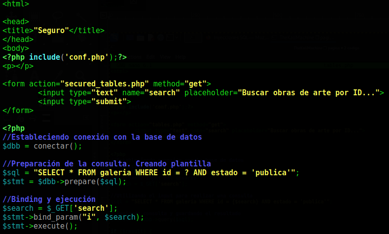

# Testeando


# [Makrdown Cheatsheet](https://github.com/adam-p/markdown-here/wiki/Markdown-Cheatsheet)

# H1
## H2
### H3
#### H4
##### H5
###### H6


---

Testing

<pre><font class="ej">ALGO</font></pre>


---

<div id="toc_container">
<p class="toc_title">Tabla de Contenidos</p>
<ul class="toc_list">
  <li><a href="#First_Point_Header">1 First Point Header</a>
  <ul>
    <li><a href="#First_Sub_Point_1">1.1 First Sub Point 1</a></li>
    <li><a href="#First_Sub_Point_2">1.2 First Sub Point 2</a></li>
    <ul>
        <li><a href="lol">1.1.1 Second Sub Point 1</a></li>
    </ul>
  </ul>
</li>
<li><a href="#Second_Point_Header">2 Second Point Header</a></li>
<li><a href="#Third_Point_Header">3 Third Point Header</a></li>
</ul>
</div>

- [x] Write the press release
- [ ] Update the website
- [ ] Contact the media 

<a>link<a>

<a class="ej">link class ej</a>

<pre>pre1</pre>
<pre>pre2</pre>

<pre>
pre
3
</pre>

<pre class="highlight">pre class highlight</pre>

<code>code</code>

<kbd>kbd</kbd>

<samp>samp</samp>

```
codigo triple backticks sin sintaxis
```

```python
codigo tripe backticks python
```

```javascript
codigo triple backticks javacript
```
---

```
fachaaaeeaeaeae
```

<code> $ cat lol.txt
<kbd><small>
The is a test file created by nixCrft for demo purpose.<br>
foo is good.<br>
Foo is nice.<br>
I love FOO.
</small></kbd>
</code>

<code>sed -i 's/foo/bar/g' hello.txt<br>
cat hello.txt</code><br>

Emphasis, aka italics, with *asterisks* or _underscores_.

Strong emphasis, aka bold, with **asterisks** or __underscores__.

Combined emphasis with **asterisks and _underscores_**.

Strikethrough uses two tildes. ~~Scratch this.~~


1. First ordered list item
2. Another item
  * Unordered sub-list.
1. Actual numbers don't matter, just that it's a number
  1. Ordered sub-list
4. And another item.

   You can have properly indented paragraphs within list items. Notice the blank line above, and the leading spaces (at least one, but we'll use three here to also align the raw Markdown).

   To have a line break without a paragraph, you will need to use two trailing spaces.  
   Note that this line is separate, but within the same paragraph.  
   (This is contrary to the typical GFM line break behaviour, where trailing spaces are not required.)

* Unordered list can use asterisks
- Or minuses
+ Or pluses


[I'm an inline-style link](https://www.google.com)

[I'm an inline-style link with title](https://www.google.com "Google's Homepage")

[I'm a reference-style link][Arbitrary case-insensitive reference text]

[I'm a relative reference to a repository file](../blob/master/LICENSE)

[You can use numbers for reference-style link definitions][1]

Or leave it empty and use the [link text itself].

URLs and URLs in angle brackets will automatically get turned into links.
http://www.example.com or <http://www.example.com> and sometimes
example.com (but not on Github, for example).

Some text to show that the reference links can follow later.

[arbitrary case-insensitive reference text]: https://www.mozilla.org
[1]: http://slashdot.org
[link text itself]: http://www.reddit.com


Here's our logo (hover to see the title text):

Inline-style:


Reference-style:
![alt text][logo]

[logo]: https://github.com/adam-p/markdown-here/raw/master/src/common/images/icon48.png "Logo Title Text 2"

Large image


Inline `code` has `back-ticks around` it.

```javascript
var s = "JavaScript syntax highlighting";
alert(s);
```

```python
s = "Python syntax highlighting"
print s
```

```
No language indicated, so no syntax highlighting.
But let's throw in a <b>tag</b>.
```


Colons can be used to align columns.

| Tables        | Are           | Cool  |
| ------------- |:-------------:| -----:|
| col 3 is      | right-aligned | $1600 |
| col 2 is      | centered      |   $12 |
| zebra stripes | are neat      |    $1 |

There must be at least 3 dashes separating each header cell.
The outer pipes (|) are optional, and you don't need to make the
raw Markdown line up prettily. You can also use inline Markdown.


Markdown | Less | Pretty
--- | --- | ---
*Still* | `renders` | **nicely**
1 | 2 | 3


> Blockquotes are very handy in email to emulate reply text.
> This line is part of the same quote.

Quote break.

> This is a very long line that will still be quoted properly when it wraps. Oh boy let's keep writing to make sure this is long enough to actually wrap for everyone. Oh, you can *put* **Markdown** into a blockquote.


<dl>
  <dt>Definition list</dt>
  <dd>Is something people use sometimes.</dd>

  <dt>Markdown in HTML</dt>
  <dd>Does *not* work **very** well. Use HTML <em>tags</em>.</dd>
</dl>


Three or more...

---

Hyphens

***

Asterisks

___

Underscores


Here's a line for us to start with.

This line is separated from the one above by two newlines, so it will be a *separate paragraph*.

This line is also a separate paragraph, but...
This line is only separated by a single newline, so it's a separate line in the *same paragraph*.


# [Bootstrap Theme Example](https://getbootstrap.com/docs/3.3/examples/theme/)


<!-- Main jumbotron for a primary marketing message or call to action -->
<div class="jumbotron">
  <h1>Theme example</h1>
  <p>This is a template showcasing the optional theme stylesheet included in Bootstrap. Use it as a starting point to create something more unique by building on or modifying it.</p>
</div>


<h1>Buttons</h1>
<p>
  <button type="button" class="btn btn-lg btn-default">Default</button>
  <button type="button" class="btn btn-lg btn-primary">Primary</button>
  <button type="button" class="btn btn-lg btn-success">Success</button>
  <button type="button" class="btn btn-lg btn-info">Info</button>
  <button type="button" class="btn btn-lg btn-warning">Warning</button>
  <button type="button" class="btn btn-lg btn-danger">Danger</button>
  <button type="button" class="btn btn-lg btn-link">Link</button>
</p>
<p>
  <button type="button" class="btn btn-default">Default</button>
  <button type="button" class="btn btn-primary">Primary</button>
  <button type="button" class="btn btn-success">Success</button>
  <button type="button" class="btn btn-info">Info</button>
  <button type="button" class="btn btn-warning">Warning</button>
  <button type="button" class="btn btn-danger">Danger</button>
  <button type="button" class="btn btn-link">Link</button>
</p>
<p>
  <button type="button" class="btn btn-sm btn-default">Default</button>
  <button type="button" class="btn btn-sm btn-primary">Primary</button>
  <button type="button" class="btn btn-sm btn-success">Success</button>
  <button type="button" class="btn btn-sm btn-info">Info</button>
  <button type="button" class="btn btn-sm btn-warning">Warning</button>
  <button type="button" class="btn btn-sm btn-danger">Danger</button>
  <button type="button" class="btn btn-sm btn-link">Link</button>
</p>
<p>
  <button type="button" class="btn btn-xs btn-default">Default</button>
  <button type="button" class="btn btn-xs btn-primary">Primary</button>
  <button type="button" class="btn btn-xs btn-success">Success</button>
  <button type="button" class="btn btn-xs btn-info">Info</button>
  <button type="button" class="btn btn-xs btn-warning">Warning</button>
  <button type="button" class="btn btn-xs btn-danger">Danger</button>
  <button type="button" class="btn btn-xs btn-link">Link</button>
</p>


<h1>Tables</h1>
<div class="row">
  <div class="col-md-6">
    <table class="table">
      <thead>
        <tr>
          <th>#</th>
          <th>First Name</th>
          <th>Last Name</th>
          <th>Username</th>
        </tr>
      </thead>
      <tbody>
        <tr>
          <td>1</td>
          <td>Mark</td>
          <td>Otto</td>
          <td>@mdo</td>
        </tr>
        <tr>
          <td>2</td>
          <td>Jacob</td>
          <td>Thornton</td>
          <td>@fat</td>
        </tr>
        <tr>
          <td>3</td>
          <td>Larry</td>
          <td>the Bird</td>
          <td>@twitter</td>
        </tr>
      </tbody>
    </table>
  </div>
  <div class="col-md-6">
    <table class="table table-striped">
      <thead>
        <tr>
          <th>#</th>
          <th>First Name</th>
          <th>Last Name</th>
          <th>Username</th>
        </tr>
      </thead>
      <tbody>
        <tr>
          <td>1</td>
          <td>Mark</td>
          <td>Otto</td>
          <td>@mdo</td>
        </tr>
        <tr>
          <td>2</td>
          <td>Jacob</td>
          <td>Thornton</td>
          <td>@fat</td>
        </tr>
        <tr>
          <td>3</td>
          <td>Larry</td>
          <td>the Bird</td>
          <td>@twitter</td>
        </tr>
      </tbody>
    </table>
  </div>
</div>

<div class="row">
  <div class="col-md-6">
    <table class="table table-bordered">
      <thead>
        <tr>
          <th>#</th>
          <th>First Name</th>
          <th>Last Name</th>
          <th>Username</th>
        </tr>
      </thead>
      <tbody>
        <tr>
          <td rowspan="2">1</td>
          <td>Mark</td>
          <td>Otto</td>
          <td>@mdo</td>
        </tr>
        <tr>
          <td>Mark</td>
          <td>Otto</td>
          <td>@TwBootstrap</td>
        </tr>
        <tr>
          <td>2</td>
          <td>Jacob</td>
          <td>Thornton</td>
          <td>@fat</td>
        </tr>
        <tr>
          <td>3</td>
          <td colspan="2">Larry the Bird</td>
          <td>@twitter</td>
        </tr>
      </tbody>
    </table>
  </div>
  <div class="col-md-6">
    <table class="table table-condensed">
      <thead>
        <tr>
          <th>#</th>
          <th>First Name</th>
          <th>Last Name</th>
          <th>Username</th>
        </tr>
      </thead>
      <tbody>
        <tr>
          <td>1</td>
          <td>Mark</td>
          <td>Otto</td>
          <td>@mdo</td>
        </tr>
        <tr>
          <td>2</td>
          <td>Jacob</td>
          <td>Thornton</td>
          <td>@fat</td>
        </tr>
        <tr>
          <td>3</td>
          <td colspan="2">Larry the Bird</td>
          <td>@twitter</td>
        </tr>
      </tbody>
    </table>
  </div>
</div>


<h1>Thumbnails</h1>


<h1>Labels</h1>
<div>
  <h1>
    <span class="label label-default">Default</span>
    <span class="label label-primary">Primary</span>
    <span class="label label-success">Success</span>
    <span class="label label-info">Info</span>
    <span class="label label-warning">Warning</span>
    <span class="label label-danger">Danger</span>
  </h1>
</div>
<h2>
  <span class="label label-default">Default</span>
  <span class="label label-primary">Primary</span>
  <span class="label label-success">Success</span>
  <span class="label label-info">Info</span>
  <span class="label label-warning">Warning</span>
  <span class="label label-danger">Danger</span>
</h2>
<h3>
  <span class="label label-default">Default</span>
  <span class="label label-primary">Primary</span>
  <span class="label label-success">Success</span>
  <span class="label label-info">Info</span>
  <span class="label label-warning">Warning</span>
  <span class="label label-danger">Danger</span>
</h3>
<h4>
  <span class="label label-default">Default</span>
  <span class="label label-primary">Primary</span>
  <span class="label label-success">Success</span>
  <span class="label label-info">Info</span>
  <span class="label label-warning">Warning</span>
  <span class="label label-danger">Danger</span>
</h4>
<h5>
  <span class="label label-default">Default</span>
  <span class="label label-primary">Primary</span>
  <span class="label label-success">Success</span>
  <span class="label label-info">Info</span>
  <span class="label label-warning">Warning</span>
  <span class="label label-danger">Danger</span>
</h5>
<h6>
  <span class="label label-default">Default</span>
  <span class="label label-primary">Primary</span>
  <span class="label label-success">Success</span>
  <span class="label label-info">Info</span>
  <span class="label label-warning">Warning</span>
  <span class="label label-danger">Danger</span>
</h6>
<p>
  <span class="label label-default">Default</span>
  <span class="label label-primary">Primary</span>
  <span class="label label-success">Success</span>
  <span class="label label-info">Info</span>
  <span class="label label-warning">Warning</span>
  <span class="label label-danger">Danger</span>
</p>


<h1>Alerts</h1>
<div class="alert alert-success" role="alert">
  <strong>Well done!</strong> You successfully read this important alert message.
</div>
<div class="alert alert-info" role="alert">
  <strong>Heads up!</strong> This alert needs your attention, but it's not super important.
</div>
<div class="alert alert-warning" role="alert">
  <strong>Warning!</strong> Best check yo self, you're not looking too good.
</div>
<div class="alert alert-danger" role="alert">
  <strong>Oh snap!</strong> Change a few things up and try submitting again.
</div>


<h1>Progress bars</h1>
<div class="progress">
  <div class="progress-bar" role="progressbar" aria-valuenow="60" aria-valuemin="0" aria-valuemax="100" style="width: 60%;"><span class="sr-only">60% Complete</span></div>
</div>
<div class="progress">
  <div class="progress-bar progress-bar-success" role="progressbar" aria-valuenow="40" aria-valuemin="0" aria-valuemax="100" style="width: 40%"><span class="sr-only">40% Complete (success)</span></div>
</div>
<div class="progress">
  <div class="progress-bar progress-bar-info" role="progressbar" aria-valuenow="20" aria-valuemin="0" aria-valuemax="100" style="width: 20%"><span class="sr-only">20% Complete</span></div>
</div>
<div class="progress">
  <div class="progress-bar progress-bar-warning" role="progressbar" aria-valuenow="60" aria-valuemin="0" aria-valuemax="100" style="width: 60%"><span class="sr-only">60% Complete (warning)</span></div>
</div>
<div class="progress">
  <div class="progress-bar progress-bar-danger" role="progressbar" aria-valuenow="80" aria-valuemin="0" aria-valuemax="100" style="width: 80%"><span class="sr-only">80% Complete (danger)</span></div>
</div>
<div class="progress">
  <div class="progress-bar progress-bar-striped" role="progressbar" aria-valuenow="60" aria-valuemin="0" aria-valuemax="100" style="width: 60%"><span class="sr-only">60% Complete</span></div>
</div>
<div class="progress">
  <div class="progress-bar progress-bar-success" style="width: 35%"><span class="sr-only">35% Complete (success)</span></div>
  <div class="progress-bar progress-bar-warning" style="width: 20%"><span class="sr-only">20% Complete (warning)</span></div>
  <div class="progress-bar progress-bar-danger" style="width: 10%"><span class="sr-only">10% Complete (danger)</span></div>
</div>

<h1>Panels</h1>
<div class="row">
  <div class="col-sm-4">
    <div class="panel panel-default">
      <div class="panel-heading">
        <h3 class="panel-title">Panel title</h3>
      </div>
      <div class="panel-body">
        Panel content
      </div>
    </div>
    <div class="panel panel-primary">
      <div class="panel-heading">
        <h3 class="panel-title">Panel title</h3>
      </div>
      <div class="panel-body">
        Panel content
      </div>
    </div>
  </div><!-- /.col-sm-4 -->
  <div class="col-sm-4">
    <div class="panel panel-success">
      <div class="panel-heading">
        <h3 class="panel-title">Panel title</h3>
      </div>
      <div class="panel-body">
        Panel content
      </div>
    </div>
    <div class="panel panel-info">
      <div class="panel-heading">
        <h3 class="panel-title">Panel title</h3>
      </div>
      <div class="panel-body">
        Panel content
      </div>
    </div>
  </div><!-- /.col-sm-4 -->
  <div class="col-sm-4">
    <div class="panel panel-warning">
      <div class="panel-heading">
        <h3 class="panel-title">Panel title</h3>
      </div>
      <div class="panel-body">
        Panel content
      </div>
    </div>
    <div class="panel panel-danger">
      <div class="panel-heading">
        <h3 class="panel-title">Panel title</h3>
      </div>
      <div class="panel-body">
        Panel content
      </div>
    </div>
  </div><!-- /.col-sm-4 -->
</div>


<h1>Wells</h1>
<div class="well">
  <p>Lorem ipsum dolor sit amet, consectetur adipiscing elit. Maecenas sed diam eget risus varius blandit sit amet non magna. Lorem ipsum dolor sit amet, consectetur adipiscing elit. Praesent commodo cursus magna, vel scelerisque nisl consectetur et. Cras mattis consectetur purus sit amet fermentum. Duis mollis, est non commodo luctus, nisi erat porttitor ligula, eget lacinia odio sem nec elit. Aenean lacinia bibendum nulla sed consectetur.</p>
</div>


## Table of Contents

- [Underline](#underline)
- [Indent](#indent)
- [Center](#center)
- [Color](#color)


<div class="containerd">
  <input type="checkbox" id="zoomCheck">
  <label for="zoomCheck">
    
  </label>
</div>

<br><br>

<div class="point-img-zoom">
  
</div>

<br><br>


<style>

input[type=checkbox] {
  display: none;
}

.containerd img {
  transition: transform 0.25s ease;
  cursor: zoom-in;
}

input[type=checkbox]:checked ~ label > img {
  transform: scale(2);
  cursor: zoom-out;
}

<!--Point-zoom Container-->
.point-img-zoom img {
  transform-origin: 65% 75%;
  transition: transform 1s, filter .5s ease-out;
}

<!--The Transformation-->
.point-img-zoom:onclick img {
  transform: scale(5);
}


//.divdiv {
  position:fixed;
  width:20em;
  height:20em;
  background:red;
  margin-bottom:32px;
  margin-top:72px;
//}


#toc_container {  
    background: #fff none repeat scroll 0 0;
    border: 1px solid #aaa;
    display: table;
    font-size: 95%;
    margin-bottom: 1em;
    padding: 20px;
    width: auto;
}

.toc_title {
    font-weight: 700;
    text-align: center;  
}

#toc_container li, #toc_container ul, #toc_container ul li{
     list-style: outside none none !important;
}

body{
  background: linear-gradient($body-bg-header 10%, $body-bg 100%);
}

//Inline and block code styles
code,
kbd,
pre,
samp {
  font-family: $font-family-monospace;
}

// Inline code
code {
  padding: 2px 4px;
  font-size: 90%;
  color: $code-color;
  background-color: $code-bg;
  border-radius: $border-radius-base;
}

// User input typically entered via keyboard
kbd {
  padding: 2px 4px;
  font-size: 90%;
  color: $kbd-color;
  background-color: $kbd-bg;
  border-radius: $border-radius-small;
  box-shadow: inset 0 -1px 0 rgba(0,0,0,.25);

  kbd {
    padding: 0;
    font-size: 100%;
    font-weight: bold;
    box-shadow: none;
  }
}

// Blocks of code
pre {
  display: block;
  padding: (($line-height-computed - 1) / 2);
  margin: 0 0 ($line-height-computed / 2);
  font-size: ($font-size-base - 1); // 14px to 13px
  line-height: $line-height-base;
  word-break: break-all;
  word-wrap: break-word;
  color: $pre-color;
  background-color: $pre-bg;
  border: 1px solid #ccc;
  border-radius: $border-radius-base;

  // Account for some code outputs that place code tags in pre tags
  code {
    padding: 0;
    font-size: inherit;
    color: inherit;
    white-space: pre-wrap;
    background-color: transparent;
    border-radius: 0;
  }
}

// Enable scrollable blocks of code
.pre-scrollable {
  max-height: $pre-scrollable-max-height;
  overflow-y: scroll;
}

</style>
